# RiskTrace Frontend — Angular 18 Single Page Application

> *The presentation layer of the RiskTrace ecosystem. A modern, scalable Angular 18 SPA providing real-time telemetry dashboards, AI performance analytics, and comprehensive incident management workflows for security analysts and platform administrators.*

---

## Tech Stack

| Technology | Version | Role |
|---|---|---|
| **Angular** | 18 | Core framework (Standalone Components, Signals, new `@if`/`@for` Control Flow) |
| **TypeScript** | 5.4 | Type safety across the entire codebase |
| **RxJS** | 7 | Reactive state management, SSE streaming, and HTTP orchestration |
| **SCSS** | — | Custom Design System with CSS variables for dark/light theming |
| **ApexCharts** | — | Interactive data visualizations (Area, Donut, Radar, Scatter, Bar) |
| **Lucide Icons** | — | Lightweight SVG icon set |
| **ngx-translate** | — | Runtime i18n (English / French) |

---

## Feature-Based Architecture

As the application scaled to encompass global admin views, AI analytics, and multi-tenant organization management, the codebase was migrated from a flat, monolithic `pages/` structure to a strict **Feature-Based Architecture**, enforcing vertical slicing across three distinct layers:

```text
src/app/
├── core/                          # Singleton services, Guards, Interceptors
│   ├── guards/
│   │   ├── auth.guard.ts          # JWT presence check → redirect to /auth/login
│   │   └── role.guard.ts          # RBAC enforcement (PLATFORM_ADMIN / ADMIN)
│   ├── interceptors/
│   │   └── jwt.interceptor.ts     # Bearer injection + automatic 401 refresh
│   └── services/
│       ├── api.service.ts         # Centralized HTTP client (all backend calls)
│       ├── auth.service.ts        # JWT state, login/logout, MFA, role checks
│       ├── avatar.service.ts      # Avatar/logo upload, cache, global change bus
│       ├── data.service.ts        # Stub service for placeholder pages
│       ├── language.service.ts    # i18n manager (en/fr), localStorage persistence
│       ├── organization.service.ts # Multi-tenancy state (active org, BehaviorSubject)
│       └── theme.service.ts       # Dark/light toggle, prefers-color-scheme detection
├── shared/                        # Reusable, presentation-only components
│   ├── components/
│   │   ├── avatar/                # Deterministic color, upload, global reactive updates
│   │   ├── sidebar/               # Collapsible nav, live incident badge, admin section
│   │   └── topbar/                # Search (Ctrl+K), notifications, ML status indicator
│   └── layout/
│       ├── main-layout/           # Authenticated shell (Sidebar + Topbar + <router-outlet>)
│       └── auth-layout/           # Minimal wrapper for login page
└── features/
    ├── admin/                     # Admin Dashboard, User & Org Management, Global Logs
    ├── auth/                      # Login, Register, 2FA, Password Reset, Email Verify
    ├── dashboard/                 # Main KPIs, Risk Heatmap, AI Scatter Plots
    ├── logs/                      # Log Explorer, SSE Live Tail, Incident Alerts
    ├── organizations/             # Org CRUD, Team (Invite/Remove/Transfer Ownership)
    ├── settings/                  # Profile, Password, 2FA toggle, Account deletion
    └── sites/                     # Site cards, Tracker.js snippets, API Key management
```

**Path aliases** (`@core/*`, `@shared/*`, `@features/*`) are configured in `tsconfig.json` to prevent deep relative imports like `../../../core/services/`.

### Encapsulation Rules
- **Core:** Imported once by `app.config.ts`. Contains global singleton services and HTTP interception logic.
- **Shared:** Purely presentational "dumb" components. They rely on `@Input()` / `@Output()` and have zero awareness of the business domain.
- **Features:** Smart components representing distinct routing domains. They **never import from other feature modules**, strictly adhering to vertical slicing.

---

## Application Bootstrap & Configuration

The application uses Angular 18's standalone bootstrap pattern (no `NgModule`):

| File | Responsibility |
|---|---|
| `main.ts` | Entry point. Calls `bootstrapApplication(AppComponent, appConfig)`. |
| `app.component.ts` | Root component. Template is just `<router-outlet />`. Injects `LanguageService` and `ThemeService` to initialize them immediately. |
| `app.config.ts` | Central DI configuration (Router, HTTP client + JWT interceptor, i18n, **APP_INITIALIZER**). |

The `APP_INITIALIZER` is critical: before the app renders, it checks if a `user` exists in `localStorage`. If yes, it calls `POST /api/auth/refresh` to obtain a fresh access token. If the refresh fails, it clears the stored user. This guarantees the in-memory JWT is always valid on page reload.

---

## Routing

The application has **three layout zones**:

| Zone | Layout | Guard | Contains |
|---|---|---|---|
| Main App | `MainLayoutComponent` | `AuthGuard` | Sidebar + Topbar + all authenticated pages |
| Auth | `AuthLayoutComponent` | None | Login page only |
| Standalone | No layout | None | Verify-email, Reset-password (full-page, no sidebar) |

### Main Layout Routes (requires `AuthGuard`)

| Path | Component | Extra Guard | Notes |
|---|---|---|---|
| `/` | Redirects to `/dashboard` | — | |
| `/dashboard` | `DashboardComponent` | — | |
| `/organizations` | `OrganizationsComponent` | — | Lazy loaded |
| `/incidents` | `IncidentsComponent` | — | |
| `/logs` | `LogsComponent` | — | |
| `/analytics` | `AnalyticsComponent` | — | |
| `/sites` | `SitesComponent` | — | |
| `/settings` | `SettingsComponent` | — | |
| `/api-keys` | `ApiKeysComponent` | — | |
| `/team` | `TeamComponent` | — | |
| `/admin/dashboard` | `AdminDashboardComponent` | `RoleGuard(PLATFORM_ADMIN)` | Lazy loaded |
| `/admin/organizations` | `AdminOrganizationsComponent` | `RoleGuard(PLATFORM_ADMIN)` | Lazy loaded |
| `/admin/users` | `AdminUsersComponent` | `RoleGuard(PLATFORM_ADMIN)` | Lazy loaded |
| `/admin/logs` | `AdminLogsComponent` | `RoleGuard(PLATFORM_ADMIN)` | Lazy loaded |

Admin routes use `loadComponent` (lazy loading) so they are tree-shaken out of the bundle for non-admin users.

### Standalone Routes (no layout)

| Path | Component |
|---|---|
| `/verify-email?token=...` | `VerifyEmailComponent` |
| `/reset-password?token=...` | `ResetPasswordComponent` |

---

## Core Services Deep Dive

### AuthService — Central Authentication State
The JWT access token is stored **in-memory only** (never in `localStorage`) as a security best practice. The user profile (`id`, `email`, `fullName`, `role`, `profileImageUrl`) is persisted in `localStorage` for cross-tab awareness.

| Method | Behavior |
|---|---|
| `login()` | Handles MFA flow. If `res.mfaRequired → return early` to show 2FA form. On success: stores token in-memory + user in localStorage + emits via `BehaviorSubject`. |
| `verify2fa()` | Completes the MFA step, storing token + user identically to `login()`. |
| `logout()` | Calls `POST /auth/logout` (fire-and-forget), clears in-memory token, clears `localStorage`, clears org state, does a **full page redirect** via `window.location.href` (not Angular Router). |
| `isAuthenticated()` | Returns `!!this.accessToken`. |
| `getUserRole()` / `isAdmin()` / `isPlatformAdmin()` | Role checkers reading from stored user. |

### OrganizationService — Multi-Tenancy State
This is the **heart of multi-tenancy**. It manages which organization the user is currently viewing via a `BehaviorSubject<OrganizationResponse>`. When the user switches organization, `setCurrentOrg()` fires, and every page that subscribes to `currentOrg$` automatically reloads its data for the new org.

### ApiService — Centralized HTTP Client
Every single backend call goes through this service. It covers:

| Section | Endpoints |
|---|---|
| **Auth** | `login`, `logout`, `refreshAccessToken`, `register`, `verifyEmail`, `resendVerificationEmail`, `forgotPassword`, `resetPassword`, `verify2fa` |
| **Users (Admin)** | `getUsers`, `getUser`, `updateUser`, `deleteUser`, `updateUserRole` |
| **Profile** | `getProfile`, `updateFullName`, `changePassword`, `setup2fa`, `enable2fa`, `disable2fa` |
| **Organizations** | `createOrganization`, `updateOrganization`, `getMyOrganizations`, `getAllOrganizations`, `updateOrganizationStatus`, `getOrganizationMembers`, `inviteMember`, `removeMember`, `transferOwnership` |
| **Sites** | `getSites`, `getSitesByOrganization`, `createSite`, `deleteSite`, `regenerateApiKey` |
| **Logs** | `getLogs`, `getLogsByOrganization`, `markLogAsAnomaly`, `getLiveTailUrl`, `getMlStatus` |
| **Alerts** | `createAlert`, `getAlerts`, `getAlertsByOrganization`, `getActiveAlerts`, `updateAlertStatus`, `escalateAlert` |

All requests automatically include `withCredentials: true` for cookie-based refresh tokens.

---

## Guards & Interceptors

### AuthGuard
Checks `authService.isAuthenticated()` (i.e., is the in-memory JWT present?). If not authenticated, redirects to `/auth/login` with a `returnUrl` query param so the user returns to their original destination after login.

### RoleGuard
Reads `route.data['expectedRole']` from the route config. If `expectedRole === 'PLATFORM_ADMIN'`, both `PLATFORM_ADMIN` and `ADMIN` roles are allowed. If the role doesn't match, redirects to `/dashboard`.

### JWT Interceptor (Functional, Angular 18 style)
```
Request flow:
  1. Skip auth/refresh and auth/login URLs (prevent infinite loops)
  2. Attach in-memory JWT as Authorization: Bearer header
  3. If response is 401:
     a. If not already refreshing → call POST /auth/refresh
        - On success: store new token, retry original request
        - On failure: force logout
     b. If already refreshing → queue the request, wait for the refresh to complete, then retry
```

The **refresh token** is an HttpOnly cookie managed by the backend. The frontend never reads it directly. Concurrency is handled via a `BehaviorSubject<string|null>` and a boolean `isRefreshing` flag to ensure only **one** refresh call happens at a time.

---

## Interface Walkthrough

### 1. Authentication — Login & Registration

The login page is a multi-mode component handling 4 distinct flows: Login, Registration, Forgot Password, and 2FA Verification.

<div align="center">
  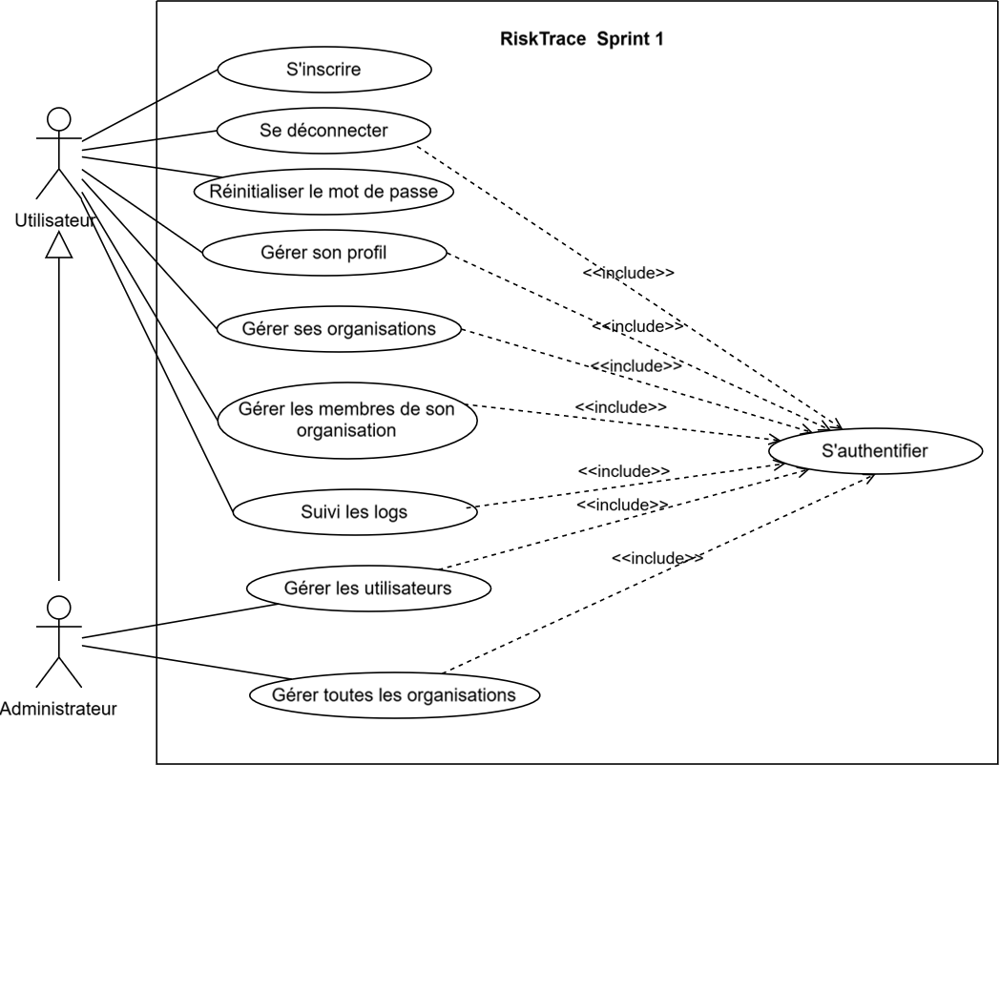
</div> Error handling maps backend error codes (`ACCOUNT_NOT_VERIFIED`, `ACCOUNT_LOCKED`, `ACCOUNT_BANNED`) to specific UI states.

<div align="center">
  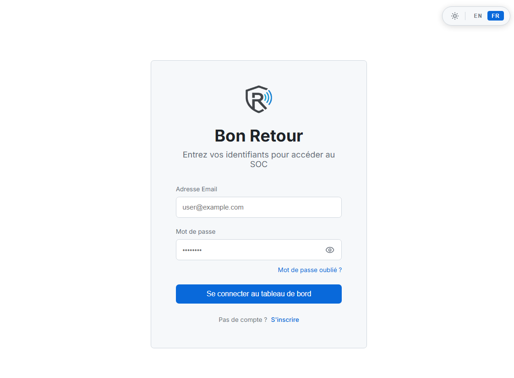
  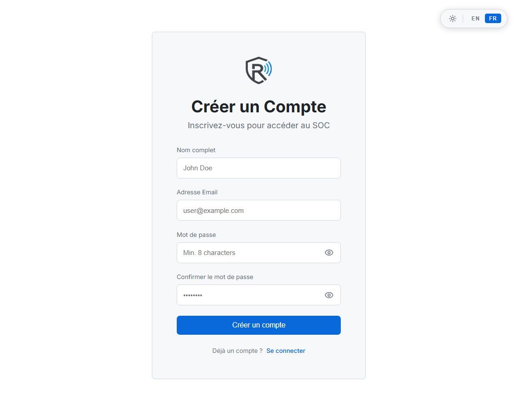
</div>

### 2. Dashboard — KPIs & Risk Analysis

The main entry point for security analysts. Subscribes to `orgService.currentOrg$` and loads data scoped to the active organization via `forkJoin({ logs, sites, alerts })`.

**Features:**
- 4 KPI cards: Total Logs, Active Sites, Anomalies Detected, Critical Alerts
- Risky Sites table: Sites sorted by anomaly count, color-coded risk levels (HIGH / MEDIUM / LOW)
- Recent Alerts list with severity badges and relative timestamps
- 3 interactive ApexCharts: Log Volume (Area), Anomaly Distribution (Donut), HTTP Methods (Bar)

<div align="center">
  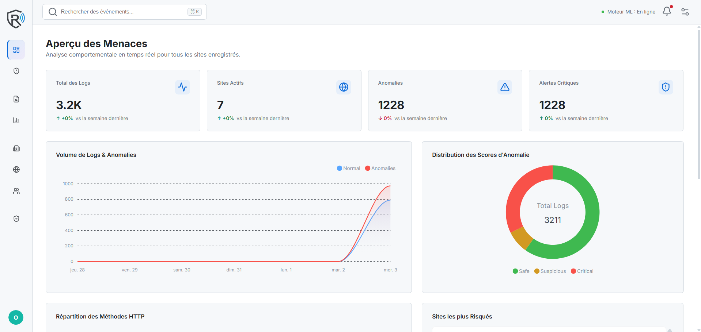
</div>
<div align="center">
  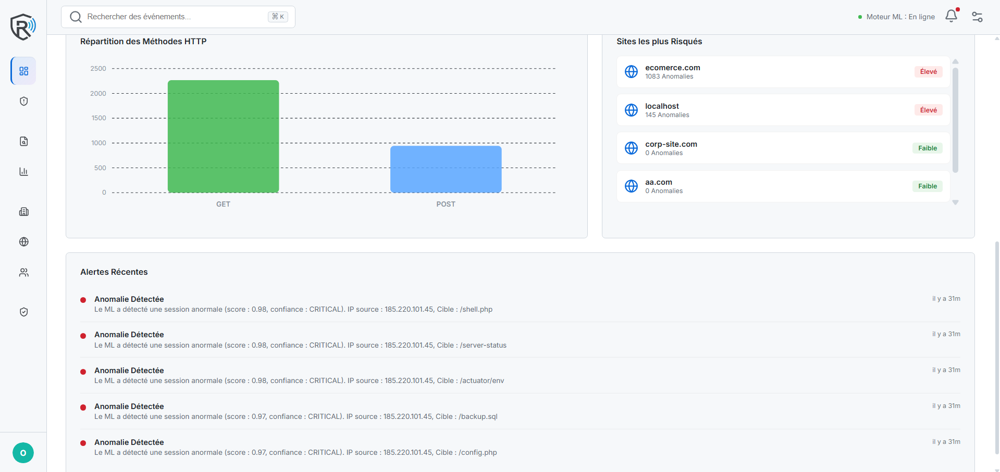
</div>

### 3. Log Explorer & SSE Live Tail

The log explorer is the most technically rich user-facing page. It supports dynamic filtering by site, HTTP status (2xx / 4xx,5xx), HTTP method, session ID, free-text search, and a minimum risk score slider. Logs can be exported to CSV or JSON.

<div align="center">
  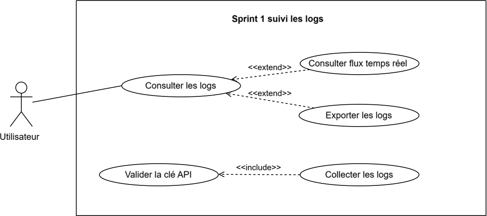
</div>

The **Live Tail** feature toggles an `EventSource` connection to `/logs/stream?token=JWT`. Using `sse.addEventListener('newLog', ...)` inside `NgZone.run()`, new logs are prepended to the list in real-time without any REST polling overhead.

<div align="center">
  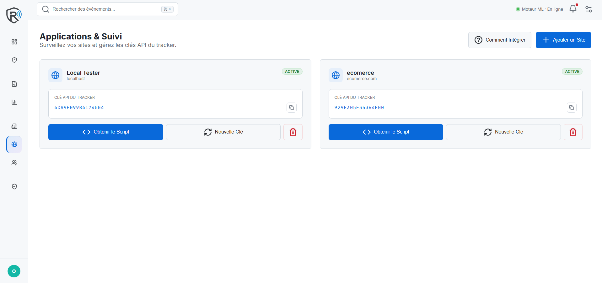
</div>

<div align="center">
  
</div>

### 4. ML Model Performance Analytics

Provides full transparency into the AI engine's internal metrics. This page polls the `GET /health` endpoint of the RiskTraceML microservice every 5 seconds to display a live status indicator.

<div align="center">
  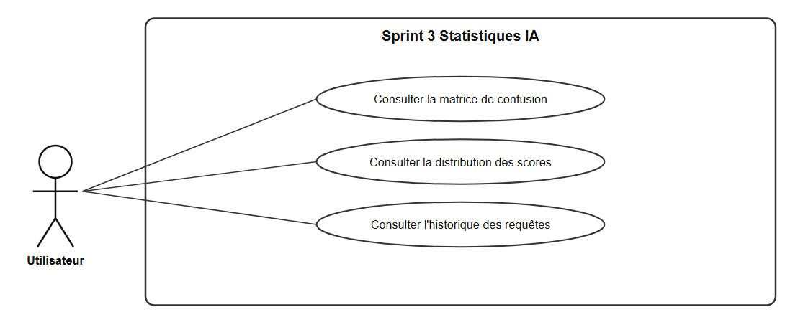
</div>

**Features:**
- KPIs: Total logs analyzed, Anomaly rate %, Critical threats (score > 0.8)
- Static offline Confusion Matrix (TP=1337, FP=609, FN=552, TN=10093) with computed Precision, Recall, F1-Score
- 3 ApexCharts: Score Distribution Histogram (with red threshold annotation at 0.70), Feature Radar (Normal vs Anomaly profiles), and a Scatter Plot of the last 200 logs plotted chronologically

<div align="center">
  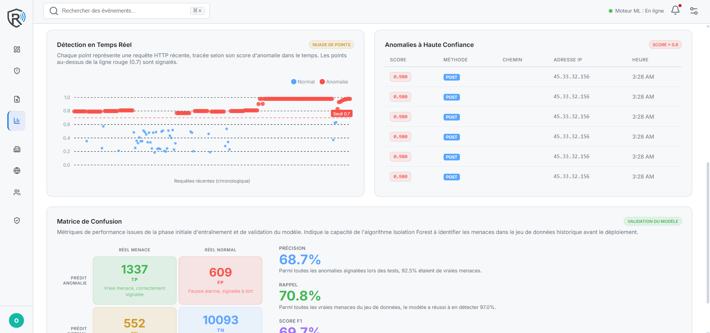
</div>

### 5. Incident & Alert Management (SOC-Style)

A fully featured Security Operations Center (SOC) view for managing anomaly alerts.

<div align="center">
  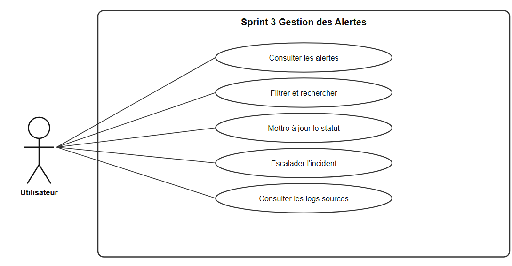
</div>

**Features:**
- Filtering by severity (CRITICAL/HIGH/MEDIUM/LOW), by site, by status (OPEN/RESOLVED/IGNORED), and free-text search
- Pagination (15 per page) with smart page range and ellipsis
- Bulk selection: checkbox per row, "select all on page", "select all matching" (across pages). Supports bulk status updates and bulk escalation
- Escalation modal: multi-incident escalation where the analyst writes a message, the system captures their identity, and sends `POST /alerts/{id}/escalate`

<div align="center">
  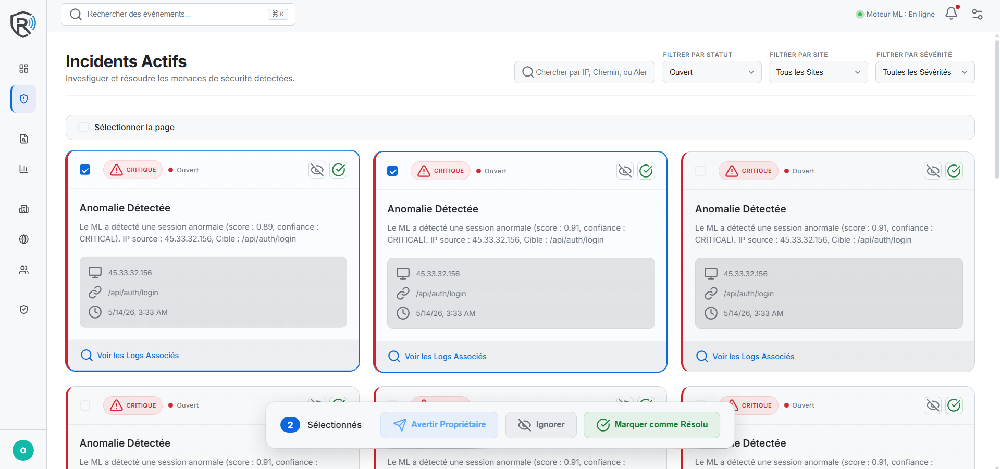
</div>

<div align="center">
  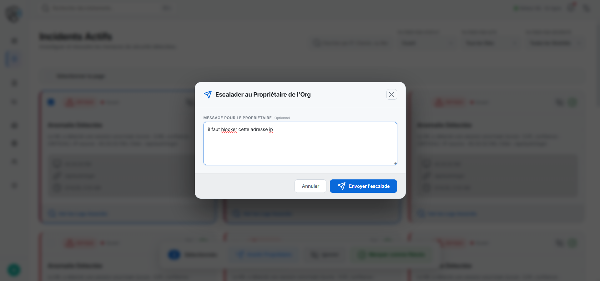
  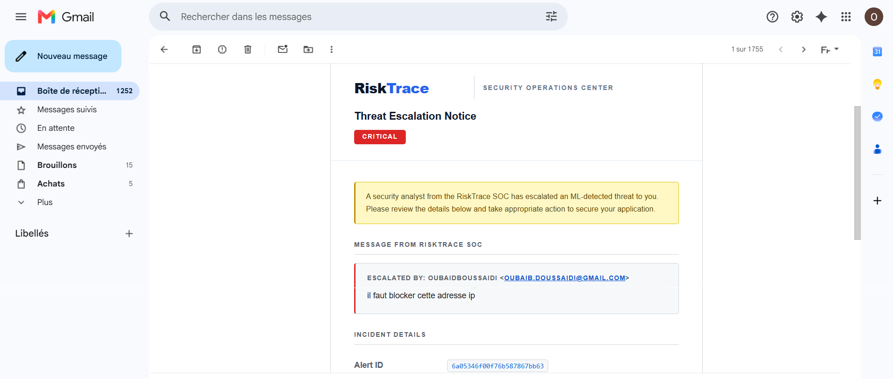
</div>

### 6. Site Management & Tracker Integration

Security teams register their domains and generate API keys. The integration modal provides ready-to-copy code snippets for **6 platforms**: Frontend JS, Node.js, Spring Boot, .NET Core, Python (FastAPI), and PHP (Laravel). Each snippet is personalized with the site's actual API key and the log collection endpoint.

### 7. Organization & Team Management

Multi-tenant organization management where users can create organizations, upload logos, invite team members, remove members, and transfer ownership.

<div align="center">
  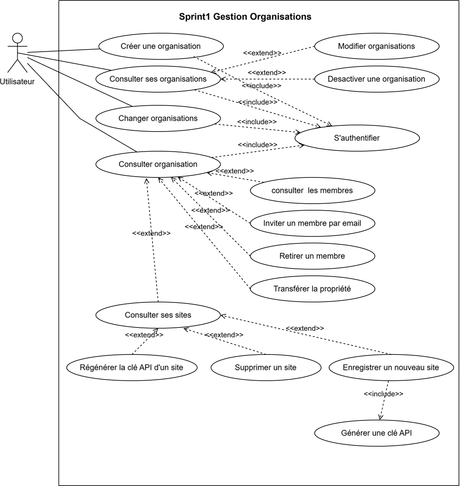
</div>

<div align="center">
  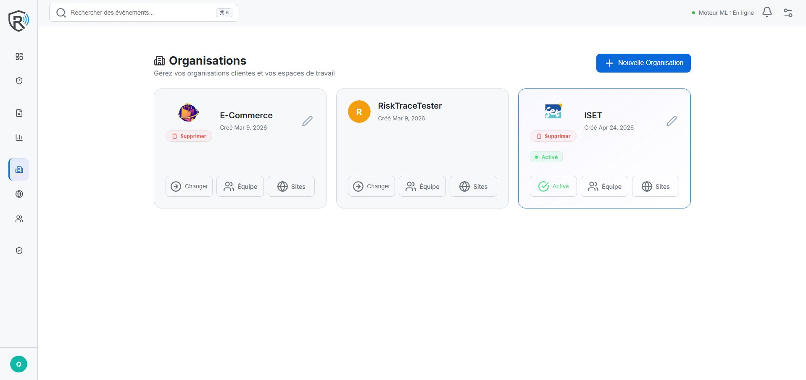
  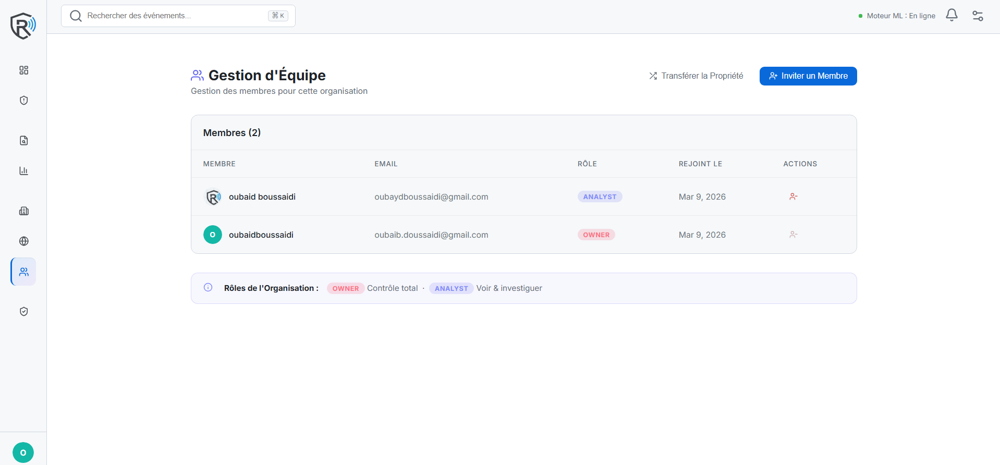
</div>

### 8. Settings — Profile, Password & 2FA

Users can edit their profile, change passwords (with strength validation: 8+ chars, letter + number), and toggle Two-Factor Authentication. 2FA setup displays a QR code for Google Authenticator scanning.

<div align="center">
  
</div>

<div align="center">
  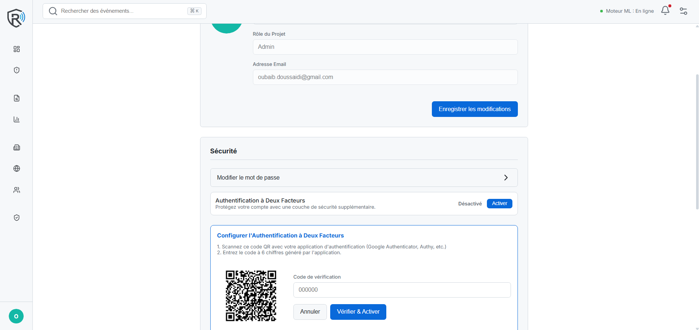
</div>

---

## Admin Panel

All admin pages are **lazy loaded** and protected by `RoleGuard(PLATFORM_ADMIN)`. Both `ADMIN` and `PLATFORM_ADMIN` roles are granted access.

### Admin Dashboard
Platform-wide overview (not scoped to a single org). Fetches all platform data via `forkJoin({ users, organizations, logs, alerts })`. Displays 4 KPIs, an Org Health Table ranked by anomaly count, and 4 ApexCharts (Logs per Org, Alert Severity Distribution, User Roles Distribution, Platform Activity Over Time).

<div align="center">
  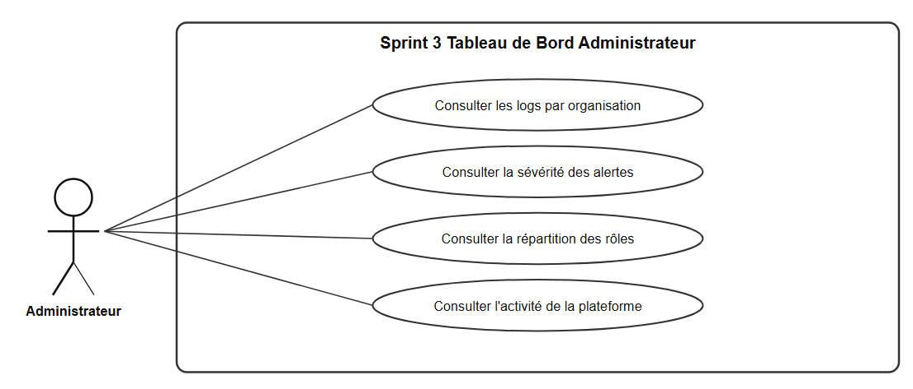
</div>

<div align="center">
  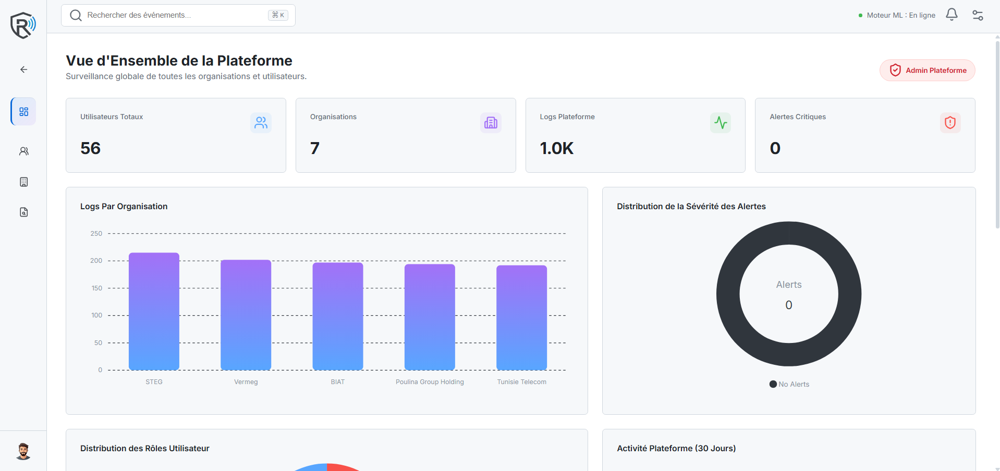
</div>

### Admin Users
The most complex admin page. Supports paginated listing (10/page) with search and role filtering. On initialization, it builds a `userId → orgName[]` ownership map by fetching all organizations and their members. Features include role changes (`USER` ↔ `ADMIN`), status toggling (with optimistic updates), and user deletion with automatic **Ownership Transfer Modal** if the user is a sole org owner.

<div align="center">
  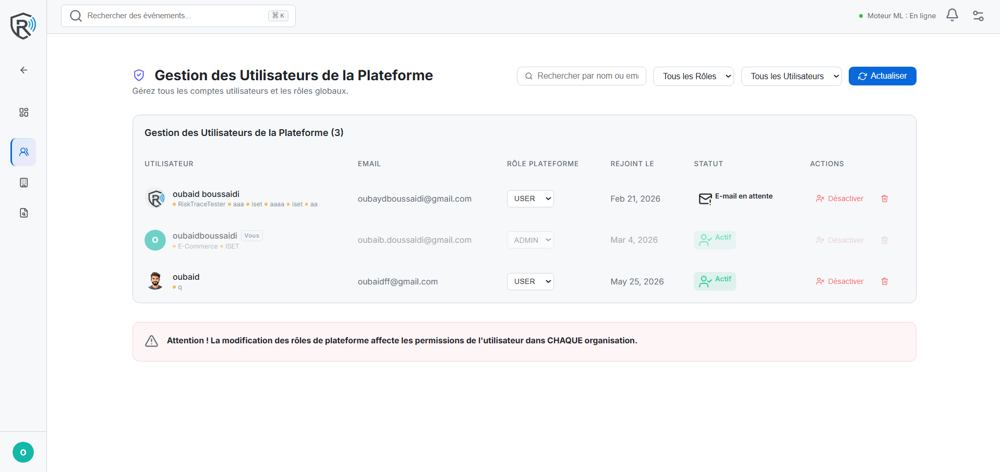
</div>

### Admin Organizations
Manages all platform organizations. Supports status toggling (enable/suspend), a slide-out detail panel showing members and sites, and the ability to assign or transfer ownership to any platform user.

<div align="center">
  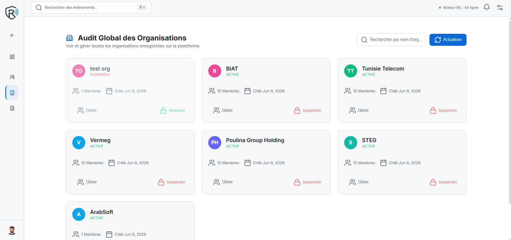
</div>

### Admin Logs
Same feature set as the user-facing Log Explorer, plus an organization filter dropdown, date range filter, and global data scope (fetches all orgs → all sites → all logs). SSE Live Tail works identically.

---

## Theming & Internationalization

### Dark / Light Theme
Default theme is `dark`. The `ThemeService` reads from `localStorage('theme')` and falls back to `prefers-color-scheme` media query. Toggling adds/removes a `data-theme="light"` attribute on `<html>`. All styles use CSS custom properties (variables) for instant theming.

### i18n (English / French)
Translation files are loaded dynamically at runtime from `public/i18n/en.json` and `fr.json`. The user's preference is cached in `localStorage('risktrace_lang')` and managed globally by `LanguageService`, which updates all active Signal bindings instantly upon a switch.

---

## Build & Deployment

### Local Development
```bash
npm install
npm start       # Dev server on http://localhost:4200
```
The development server relies on the Spring Cloud Gateway running on `localhost:8084` to proxy API calls.

### Production Build
```bash
npm run build   # AOT compilation → /dist
```

### Validation & Test Verification
The frontend code quality and route guarding logic are verified via automated browser-level and component tests completing with 0 errors:

<div align="center">
  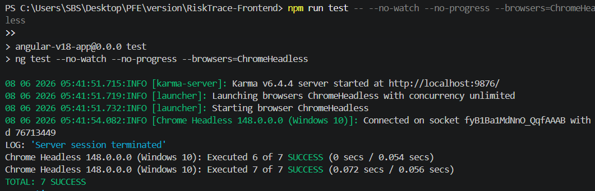
</div>
The AOT compiler optimizes Angular templates, tree-shakes unused Lucide icons, and chunks the lazy-loaded feature modules. The compiled output is served by **Nginx** (as configured in `docker-compose.yml`) or continuously deployed to **Vercel** for global edge delivery.
